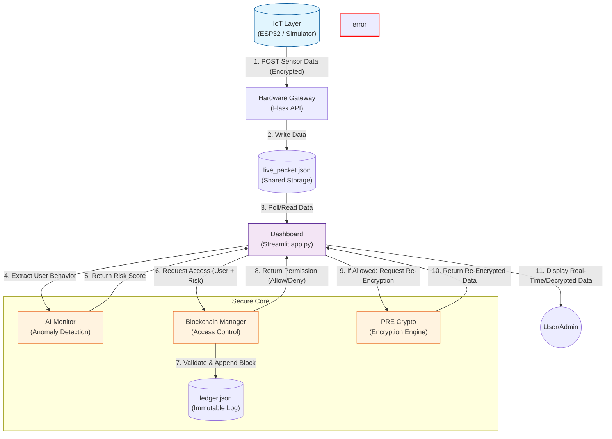

# System Data Flow Diagram

This document illustrates how data moves through the **Blockchain-Based Proxy Re-Encryption** system, starting from the IoT edge layer, passing through the gateway, and being processed by the AI and Blockchain core before reaching the user dashboard.

## Detailed Flow Description

1.  **Ingestion**: The **IoT Layer** sends encrypted sensor packets to the **Hardware Gateway** via HTTP POST.
2.  **Buffering**: The Gateway writes the latest packet to the temporary **`live_packet.json`** file.
3.  **Visualization Loop**: The **Dashboard** (Streamlit) continuously polls `live_packet.json` for new data.
4.  **Security Analysis**: Before showing data, the Dashboard sends the current session context to the **AI Monitor** to calculate a Risk Score based on behavior anomalies.
5.  **Access Control**: The Dashboard requests access from the **Blockchain Manager**, providing the User requesting access and the calculated Risk Score.
6.  **Audit Logging**: The Blockchain Manager records the request (User, Risk, Decision) into the **Immutable Ledger** (`ledger.json`) and returns a strict Allow/Deny decision.
7.  **Data Reveal**: If access is granted, the **PRE Crypto** module re-encrypts the data for the specific user, and the Dashboard displays the decrypted content.
